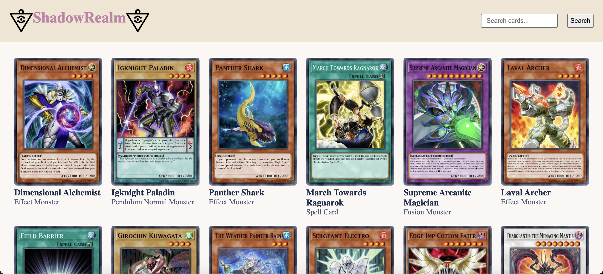

# Shadow Realm

A web app that displays random **Yu-Gi-Oh!** cards in a dynamic and visually immersive way.



The website is currently live [here](https://jose-jojo-mls.github.io/mod-4-project/)

# Features

- Users are shown a display of random Yu-Gi-Oh! cards
- Users are able to check the cheapest possible prices for desired cards
- Users can click on any card to see its details
- Users can look up any existing Yu-Gi-Oh! card

# API

All the documentation for the **API** that was used can be found in this website:

https://ygoprodeck.com/api-guide/

# Setup Instruction

After cloning down the repository, make sure to install all dependencies and run the development server using **Vite** as follows:

```zsh
# Move into the repository
cd [repository-path]

# Install dependencies
npm i

# Run the Vite development server
npm run dev
```

# The Team

**Jose Troncoso** / [Github](https://github.com/troncosojose22)

**Jojo Bernal** / [Github](https://github.com/JojolionPeak)
